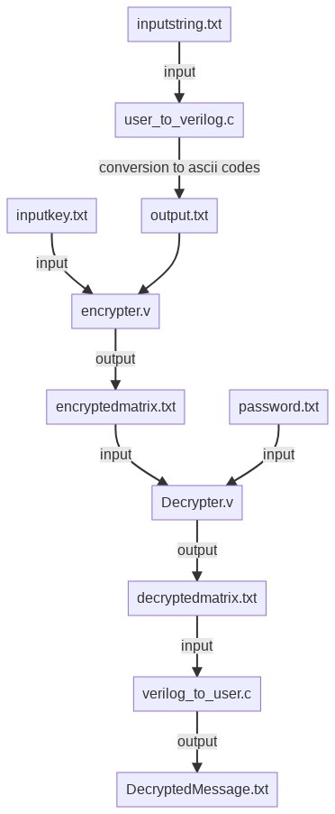

# 
 **Encryption - Decryption using matrix multiplication:** 

 

## *Instructions:*
   - ### *How to run:*
      1. Firstly write the message you want to send to the user in "inputstring.txt".
      2. Then write the key, i.e 2*2 matrix, in "inputkey.txt".
      3. Then run "user_to_verilog.c" which writes corresponding message in ascii codes in "output.txt"
      4. Then run "Encrypter.v" which will convert message into encrypted numbers.
      5. Then enter the password, i.e the same key matrix, in "password.txt".
      6. Then run "Decrypter.v" which will decrypt the encrypted matrix into ascii codes, if password is correct, in "decryptedmatrix.txt".
      7. Finally run "verilog_to_user.c" to get the message in "decryptedmessage.txt"

## Module input and outputs:
1. **user_to_verilog.c**  
    *input* : inputstring.txt --> for taking a text to be encrypted, as input.
      *output* : output.txt --> a .txt file containing ascii codes of corresponding characters in inputstring.txt. 

2. **Encrypter.v**  
    *input*  : inputkey.txt  --> For taking key from user 
             : output.txt    --> For taking ascii codes of string characters provided by user_to_verilog.c 
      *output*  : encryptedmatrix.txt --> contains the encrypted matrix, corresponding to the input  

3. **Decrypter.v**  
     *input* : encryptedmatrix.txt
            : password.txt --> contains a (2*2) password matrix entered by user.
     *output* : Decryptedmatrix.txt 

3. **verilog_to_user.c**  
     *input* : decryptedmatrix.txt
     *output* : Decryptedmessage.txt 

## Module Hierarchy:

1. inputstring.txt containing the string entered by the user is converted into the ascii codes by the user_to_verilog.c 
   and written in output.txt
2. This output.txt is taken as a input by Encrypter.v and multiplied with the inputkey matrix and stored in
   encryptedmatrix.txt.
3. Then password enterd by user in password.txt is used to decrypt encryptedmatrix to obtain the original
   message.

  

## Important Notes:
    -> Encrypter.v can encrypt upto 2000 characters in a single go, we are looking to make this limit dynamic (if possible).
       Thus, the text in inputstring.txt should not exceed 2000 characters.
    -> inputkey.txt should have a 2*2 matrix of integers, falling in the range 1 to 100 inclusive

## Author

[Yash Agarwal](https://github.com/Yash070707)

